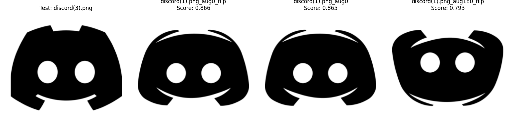
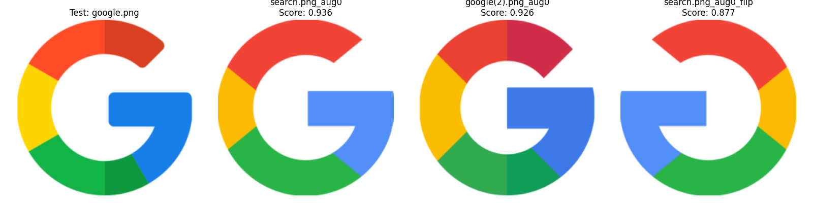
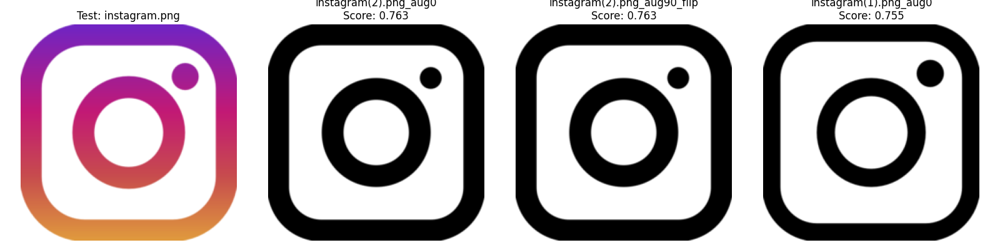
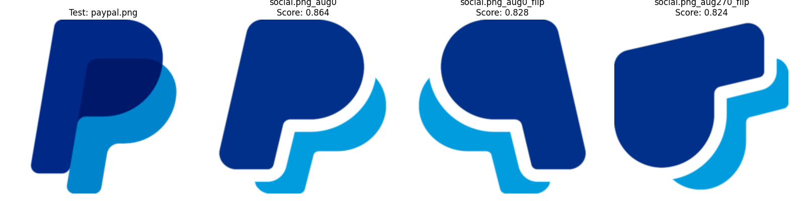

# Icon Matcher

Icon Matcher is a Python-based tool for comparing test icons against a reference set of icons using image similarity. This is useful for UI testing, automated comparison of assets, or categorization tasks.

## Features

- Compares images from a test folder against a set of reference icons
- Uses SSIM (Structural Similarity Index) for comparison
- Outputs results to a CSV file
- Optional visual output to highlight matches

## Installation

1. Clone the repository:

```bash
git clone https://github.com/Daniils12334/icon-matcher.git
cd icon-matcher
```

2. Create a virtual environment (optional but recommended):

```bash
python -m venv venv
source venv/bin/activate  # On Windows use: venv\Scripts\activate
```

3. Install dependencies:

```bash
pip install -r requirements.txt
```

## Usage

Run the tool from the command line with:

```bash
python icon_matcher.py --test_folder path/to/test_icons --ref_folder path/to/ref_icons --output results.csv
```

### Example:

```bash
python icon_matcher.py \
  --test_folder /home/danbar/icon-matcher/test_icons \
  --ref_folder /home/danbar/icon-matcher/ref_icons \
  --output results.csv
```

## Screenshots

> Below are examples of how visual outputs might look (when enabled):






## Output

The tool will generate a CSV file like this:

```
test_icon,matched_ref_icon,similarity
discord(3).png,discord.png,0.98
google.png,google(1).png,0.95
...
```

## Third-Party Notice

This project uses the ResNet-50 model architecture for feature extraction.

    If using torchvision: Model weights and architecture provided under the BSD 3-Clause License.

    Authors: Kaiming He, Xiangyu Zhang, Shaoqing Ren, Jian Sun.
    Deep Residual Learning for Image Recognition (2015)

## Author

Created by [Daniils12334](https://github.com/Daniils12334)
